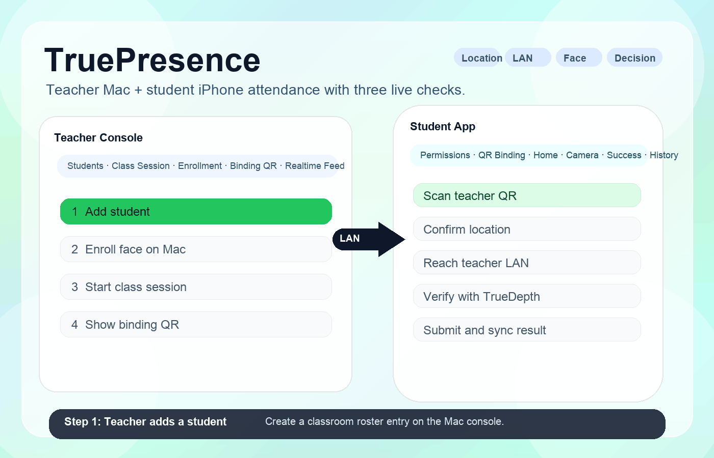
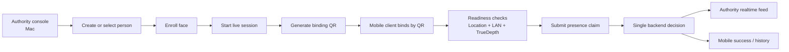
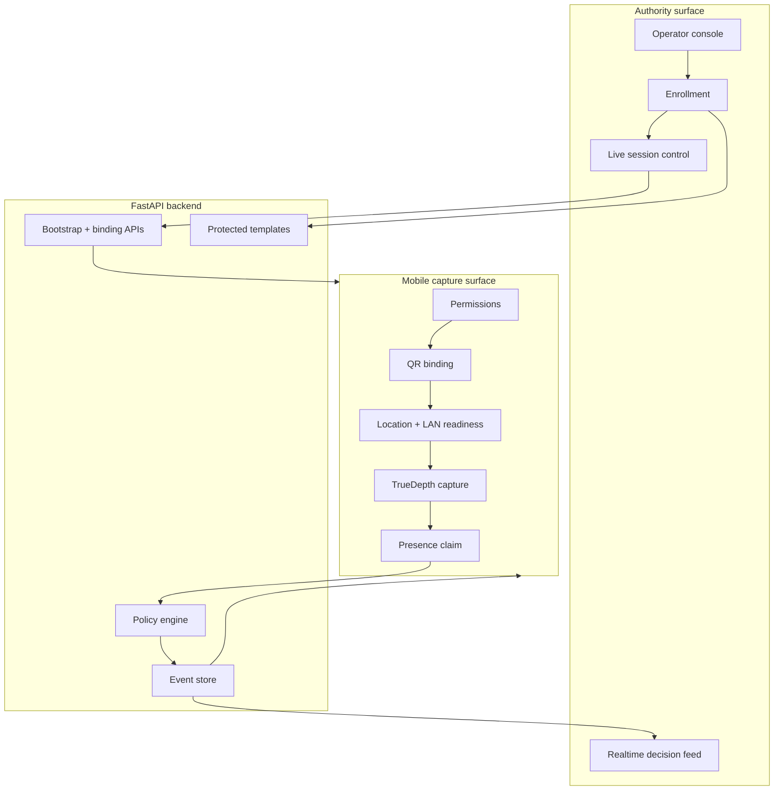

# TruePresence

<p align="center">
  
</p>

TruePresence is a **local-first presence verification platform** for controlled onsite and near-site check-in workflows. It combines three live proofs of presence in one decision path:

1. **Location / geofence**
2. **Same-LAN authority backend reachability**
3. **TrueDepth face verification with liveness evidence**

The current public repository ships a **teacher Mac + student iPhone reference deployment** to demonstrate the model end to end. That reference workflow is classroom-oriented today, but the same product architecture can be adapted to mobile workforce attendance, site operations, retail visit verification, and controlled remote or hybrid presence confirmation.

The logo above is the public mark for TruePresence. It represents a verified presence event rather than a generic camera, QR code, or map pin, which makes it reusable across education, workforce, and site-operations deployments without forcing a single vertical identity.

## App Demo

<p align="center">
  
</p>

[Direct MP4 recording](docs/assets/app-demo.mp4)

This app demo focuses on the **student-side proof flow**. It shows two outcomes from the same iPhone app:

- a successful submission when location, LAN reachability, and live face evidence all pass
- a rejection when an object occludes the face and the verification path is no longer trustworthy

This is useful for product teams because it demonstrates the actual trust boundary on the capture surface. It is not just a polished UI clip; it is a reusable example of how the app should behave when the live evidence is good versus when the input is obstructed.

## End-to-End Workflow Demo



The animation above is the **operator workflow** asset. It shows the reference end-to-end path: an authority operator creates or selects a person, enrolls a face, starts a live session, generates a QR code, and the mobile device checks in against the same backend. Teams can reuse this visual as a launch demo, onboarding sequence, or implementation checklist.

## Why This Matters

Most real-world attendance and site-presence tools still rely on one or two weak signals:

- GPS only
- QR only
- selfie upload to a cloud service

Those approaches are easy to deploy, but they are also easy to spoof or operationally weaken. TruePresence is designed for settings where the real question is:

> Was the right person physically present at the right site, on the right network context, at the right time?

The repository turns that question into a reusable product workflow:

- an **authority surface** controls enrollment, site/session state, and final decisioning
- a **mobile capture surface** gathers live presence evidence
- the result appears in **both places from one decision source**

## Where This Fits

TruePresence is broader than a classroom demo. The current reference implementation is education-first, but the underlying product model also fits:

- **Education and training**
  - classroom attendance
  - lab or workshop check-in
  - exam-room or assessment presence verification
- **Mobile workforce attendance**
  - field sales arrival confirmation
  - home-service technician shift start
  - construction or contractor site attendance
- **Site operations**
  - branch opening checks
  - store visit verification
  - controlled facility access logging
- **Route and logistics workflows**
  - checkpoint confirmation for drivers or inspectors
  - route-based arrival proofs for shift segments
- **Controlled hybrid or remote workflows**
  - managed remote start-of-shift confirmation
  - supervisor-approved near-site presence validation

The current repo does **not** claim that every one of these verticals already has a custom UI. What it does provide is the reusable trust model, policy engine shape, LAN-first deployment pattern, and mobile proof flow that those products can build on.

## What This Public Release Implements

This public repository contains a complete, reusable **reference deployment**:

- a FastAPI backend for enrollment, binding, session control, and attendance decisioning
- a teacher-facing web console for person management and realtime decision visibility
- a SwiftUI iPhone app for permissions, QR binding, readiness, camera capture, success state, history, and profile
- a protected-template biometrics package with local demo-safe interfaces
- a public-safe bootstrap with generic people and sites
- a reproducible SOP for education pilots, field attendance pilots, and edge deployments

This release intentionally excludes local runtime artifacts, personal captures, internal task memory, and company-specific branding.

## Models and Verification Pipeline

This repo now explains the biometrics path explicitly, because public users need to know what is actually running:

- **Teacher-side enrollment**
  - the authority console supports `Mac camera` enrollment as the primary path
  - it also supports a `single-photo upload fallback` for rapid setup or recovery
  - the backend endpoint for both paths is `POST /v1/demo/control/enroll-from-mac`
- **Mobile-side live verification**
  - the iPhone app uses Apple's **Vision** face detection (`VNDetectFaceRectanglesRequest`)
  - it uses a bundled Core ML face embedder, **`ArcFaceMobileFace.mlmodelc`**, for on-device face representation
  - it uses front **TrueDepth** depth evidence and liveness gating before claim submission
- **Template protection and matching**
  - the repo stores **protected templates**, not raw face embeddings, in its default public-safe flow
  - the current protected-template scheme in the shipped app is `signed-random-projection-v1`
  - the backend combines match score, quality, liveness, LAN reachability, and geofence policy into one canonical decision

In plain terms, the flow is:

1. the authority side captures or uploads a reference face
2. the backend creates protected templates for that identity
3. the iPhone captures a live face with TrueDepth
4. the iPhone extracts a protected claim representation on-device
5. the backend compares that live claim against the enrolled templates and applies policy checks

This section is useful for builders because it tells them exactly where to swap components:

- replace the enrollment path if they want a different operator workflow
- replace the Core ML embedder if they need a different model family
- replace the template protection scheme if they need a stronger or regulated deployment posture
- keep the same authority/mobile split if they want the same operational trust model

## Reference Workflow



This diagram shows the reusable operational contract, not just the classroom skin. In the shipped reference UI, the authority is a teacher and the mobile user is a student. In other deployments, the same contract maps cleanly to supervisor/worker, dispatcher/driver, or manager/field rep.

## System Architecture



The architecture matters because it makes the product reusable across verticals. The authority device is not just a dashboard, and the mobile device is not just a camera client. One side owns trust and session state; the other side proves live presence. That split is what lets the system stay locally deployable while still being operationally auditable.

## Why This Is Different

| Approach | What it proves well | Common failure mode | Operational trade-off | TruePresence advantage |
| --- | --- | --- | --- | --- |
| GPS only | broad area presence | spoofed location or loose radius | easy to deploy, weak proof | adds LAN and live face evidence |
| QR only | a code was seen | remote forwarding or shared code | very fast, easy to abuse | binds QR to device and requires live verification |
| Cloud selfie check-in | a face image exists | replay, weak site proof, higher privacy concerns | simple rollout, central dependency | keeps authority local and site-aware |
| **TruePresence** | person, place, and local context together | requires a trusted authority device or edge backend | higher setup rigor, much stronger operational assurance | combines geofence, same-LAN proof, and TrueDepth liveness in one flow |

This comparison table is meant to guide product selection, not make vague “beats SOTA” claims. Its reuse value is practical: teams can use it to decide which failure modes matter most in their own environment before they commit to a deployment model.

## Reference Results

### Local backend reference timings

| Metric | Reference setup | Median | P95 | What it means |
| --- | --- | ---: | ---: | --- |
| `GET /v1/mobile/bootstrap` | in-process FastAPI `TestClient` on Apple Silicon Mac | `0.91 ms` | `1.03 ms` | backend overhead to refresh live session state |
| `POST /v1/mobile/device-link/claim` | same reference setup | `0.72 ms` | `0.84 ms` | backend overhead for QR-based device binding |
| `POST /v1/attendance/claims` | same reference setup with one enrolled identity | `4.11 ms` | `4.42 ms` | backend overhead for policy + face-match decision |

These timing results are **backend-only reference numbers**. They exclude camera runtime, UI rendering, and Wi-Fi latency. That makes them reusable: another team can benchmark the same endpoints on a classroom Mac, field laptop, edge mini-PC, or branch server and quickly see where their real latency budget is being spent.

### Behavior validation matrix

| Scenario | Expected result | Why it matters |
| --- | --- | --- |
| bound identity + live session + inside geofence + LAN reachable + matching face | `Accepted` | proves the happy path is deterministic |
| outside geofence | `Rejected` with `outside_geofence` | protects site-level integrity |
| no live session | mobile app blocks submission | prevents stale or ambiguous authority state |
| LAN unavailable | submission is blocked or explicitly fails | avoids fake local-only success |
| face mismatch or failed liveness | `Rejected` | prevents proxy or spoofed check-ins |
| face obstruction during capture | `Rejected` or readiness failure | demonstrates that live evidence quality matters, not just tap-through completion |

This table is designed to be copied into other teams' QA plans. It helps teams reuse the product as an evaluation rubric, an internal acceptance checklist, or a procurement test matrix.

## Reusable SOP

TruePresence is designed to be reusable as an operator SOP:

1. Add a person in the authority console.
2. Enroll the face from the authority-side camera.
3. Generate a binding QR code.
4. Start the live session for the target site.
5. Let the mobile device bind by QR.
6. Ask the operator or attendee to complete the check-in flow.
7. Review the same decision in the authority feed and mobile history.

In the shipped reference deployment, this maps to:

- authority console -> teacher Mac
- person -> student
- site -> classroom
- live session -> active class

In other deployments, the same SOP can map to:

- authority console -> supervisor station / site lead laptop / dispatcher console
- person -> worker / field rep / driver / attendee
- site -> client site / branch / checkpoint / facility
- live session -> shift window / route stop / on-site assignment

The concrete classroom version is documented in [docs/operator-sop.md](docs/operator-sop.md).

## Repository Layout

```text
truepresence/
├── apps/
│   ├── api/              # FastAPI backend, policy engine, QR binding, and authority/mobile API contracts
│   ├── admin/            # Authority-facing web console served by the backend
│   └── ios/              # SwiftUI mobile app for permissions, QR binding, check-in, history, and profile
├── packages/
│   └── biometrics/       # Shared protected-template, capture, and verification helpers
├── data/
│   └── demo/             # Public-safe seed fixtures for generic people, sites, and reference sessions
├── docs/
│   ├── assets/           # Public README media such as the logo, app demo GIF/MP4, and hero GIF
│   ├── architecture.md   # Trust boundaries and reusable system design
│   ├── api.md            # Public endpoint overview and integration notes
│   ├── deployment.md     # LAN, Docker, and pilot deployment guidance
│   ├── evaluation.md     # Reference measurements, test setup, and interpretation
│   ├── operator-sop.md   # Step-by-step authority/mobile operating procedure
│   └── security-privacy.md # Privacy defaults, local-first assumptions, and data handling guidance
├── scripts/
│   └── public_release_audit.py # Repo hygiene audit used by CI to block sensitive leftovers
├── .github/
│   ├── workflows/        # Public CI definitions
│   ├── ISSUE_TEMPLATE/   # Bug and feature request templates
│   └── pull_request_template.md # Contributor PR checklist
├── Dockerfile            # Minimal backend container build for pilots or edge packaging
├── environment.yml       # Reproducible Conda environment for backend and local tooling
├── pyproject.toml        # Public package metadata
├── LICENSE               # Apache-2.0
└── README.md             # Product overview, media, install/deploy guide, results, and SOP entry point
```

This tree is intentionally small and product-oriented. It is designed so another team can quickly identify where to extend the authority console, the mobile app, the backend policy engine, or the public docs without reverse-engineering an internal monorepo.

## Installation

### Prerequisites

- macOS for the reference authority-side deployment
- a TrueDepth-capable iPhone for the mobile client
- Xcode for building and installing the iOS app
- Conda, with the `dl` environment available or creatable from `environment.yml`
- Docker only if you want the containerized backend path

### 1. Clone the repository

```bash
git clone https://github.com/bozliu/truepresence.git
cd truepresence
```

### 2. Create the backend environment

```bash
conda env create -n dl -f environment.yml || conda env update -n dl -f environment.yml
```

### 3. Validate the install

```bash
conda run -n dl pytest apps/api/tests/test_api.py
```

If these tests pass, you have a working local backend and a clean public fixture set. This is the fastest first-install health check before changing thresholds, policies, UI flows, or deployment targets.

## Local Development

### 1. Start the backend

```bash
conda run -n dl uvicorn app.main:app --app-dir apps/api --host 0.0.0.0 --port 8000
```

### 2. Open the authority console

- API docs: [http://127.0.0.1:8000/docs](http://127.0.0.1:8000/docs)
- Authority console: [http://127.0.0.1:8000/teacher/](http://127.0.0.1:8000/teacher/)

### 3. Install the mobile app on iPhone

Open [apps/ios/MobileAttendanceDemo.xcodeproj](apps/ios/MobileAttendanceDemo.xcodeproj) in Xcode and install the app on a TrueDepth-capable iPhone.

### 4. Run the reference operator flow

Follow [docs/operator-sop.md](docs/operator-sop.md) to:

- add a person
- enroll a face
- generate a QR code
- start a live session
- bind the iPhone
- submit the presence claim

## Deployment

### Reference LAN deployment

This is the recommended first deployment:

1. Run the backend on the authority Mac with `--host 0.0.0.0 --port 8000`.
2. Open the authority console at `/teacher/`.
3. Keep the authority device and mobile device on the same Wi-Fi.
4. Let the mobile app reach the authority backend through the canonical LAN URL.

This matters because it is the smallest real market-ready unit of the product: one authority device, one or more mobile clients, one local network, and one auditable decision source.

### Docker deployment

```bash
docker build -t truepresence .
docker run --rm -p 8000:8000 truepresence
```

Use this when moving from a developer Mac to an edge appliance, branch mini-server, training lab box, or other managed authority host. The point of keeping this path in README is reuse: another operator can turn the product into a portable on-site service without reading the whole backend source first.

### Deployment checklist

- bind the backend to `0.0.0.0`, not just `127.0.0.1`
- use the authority host's real Wi-Fi IPv4 as the canonical LAN URL
- keep authority and mobile devices on the same Wi-Fi
- grant Camera, Location, and Local Network permissions on iPhone
- verify the authority console can start a live session and generate QR before field testing
- keep the authority console and API served from the same backend

### Pilot-to-product rollout path

1. single-operator pilot on one Mac
2. shared edge appliance for one room, site, or branch
3. optional cloud sync for analytics, exports, or multi-site reporting

This progression is reusable because it preserves the product's trust model while letting operators increase scale gradually instead of rewriting the system after the first pilot.

## Documentation

- [Architecture](docs/architecture.md)
- [API Overview](docs/api.md)
- [Deployment Guide](docs/deployment.md)
- [Evaluation Methodology](docs/evaluation.md)
- [Security & Privacy Defaults](docs/security-privacy.md)
- [Operator SOP](docs/operator-sop.md)

## What Makes It Commercially Useful

TruePresence is aimed at teams that need a **real operational tool**, not just a paper demo:

- local-first deployment with one clear authority source
- stronger anti-spoofing than GPS-only or QR-only workflows
- clear operator feedback on both the authority side and the mobile side
- reusable backend contracts for new vertical-specific frontends
- portable rollout from one Mac pilot to an edge or managed backend later

In other words, this repository is positioned as a **public release with product value**. It is meant to be cloned, adapted, piloted, and extended into real education, workforce, site-operations, or controlled presence-verification products.

## Validation

The public release is validated with:

```bash
conda run -n dl pytest apps/api/tests/test_api.py
python scripts/public_release_audit.py
```

GitHub Actions also runs:

- backend tests
- a public release audit for forbidden strings and broken markdown links

## License

Apache-2.0. See [LICENSE](LICENSE).
