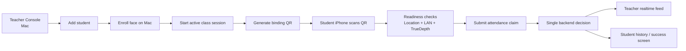
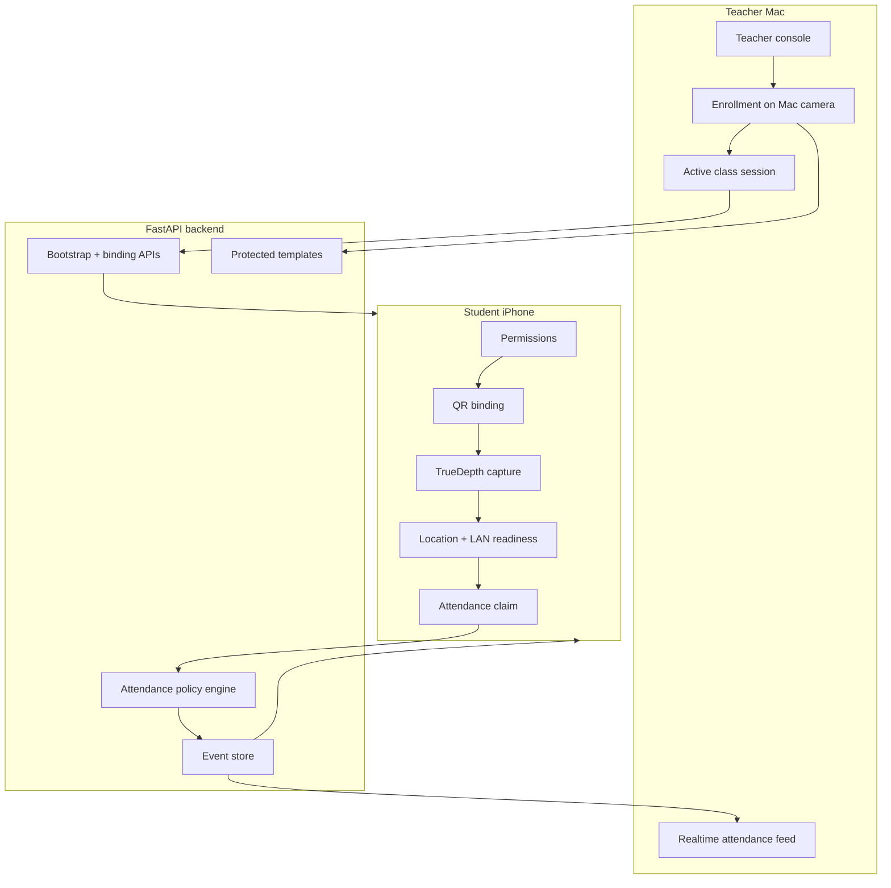

# TruePresence

<p align="center">
  
</p>

TruePresence is a local-first classroom attendance system for a **teacher Mac** and a **student iPhone**. It combines three live proofs of presence in one check-in flow:

1. **Location / geofence**
2. **Same-LAN teacher backend reachability**
3. **TrueDepth face verification with liveness evidence**


The logo above is the public app mark for TruePresence. It encodes the product promise in one symbol: a verified student presence event, rather than a generic camera or generic QR tool. Reusers can keep it as a neutral starting brand or replace it with their own institutional identity without changing the product architecture.

The hero animation above is a product-level walkthrough, not a screenshot dump. It shows the intended operator flow: the teacher creates a student, enrolls a face, starts class, generates a QR code, and the student checks in from the iPhone. You can reuse this visual as a demo script, onboarding summary, or implementation checklist.

## Why This Matters

Most real-world attendance products still rely on one or two weak factors:

- GPS only
- QR only
- selfie upload to a cloud service

Those designs are easy to deploy, but they are also easy to spoof. TruePresence is built for situations where the question is not only *“did a student tap a button?”* but *“was the right person physically present in the right room at the right time?”*

This repository packages that answer into a reusable product workflow:

- the **teacher Mac** is the authority for enrollment, class control, and final decisioning
- the **student iPhone** is the capture surface for local presence evidence
- the result appears in **both places from one decision source**

## What This Public Release Implements

This public repository contains a complete, reusable classroom workflow:

- a FastAPI backend for enrollment, binding, and attendance decisioning
- a teacher-facing web console for student management and realtime attendance
- a SwiftUI iPhone app for permissions, QR binding, classroom readiness, camera capture, success state, history, and profile
- a protected-template biometrics package with local demo-safe interfaces
- a public-safe dataset bootstrap with generic students and classrooms
- a reproducible SOP for schools, training teams, and edge deployments

This release intentionally excludes local runtime artifacts, personal captures, internal task memory, and company-specific branding.

## Product Workflow



This workflow diagram shows the operational contract of the system: the teacher prepares the authority state, the student submits presence evidence, and both surfaces consume one decision. Teams can reuse this as the baseline SOP for training, product demos, or classroom rollout playbooks.

## System Architecture



The architecture diagram shows why TruePresence is different from “cloud selfie check-in” tools. The teacher Mac is not just a dashboard; it is the classroom authority. The iPhone is not just a client; it is the live presence sensor. Others can reuse this architecture when they want a local-first system with clear operational trust boundaries.

## Why This Is Different

| Approach | What it proves well | Common failure mode | Operational trade-off | TruePresence advantage |
| --- | --- | --- | --- | --- |
| GPS only | coarse presence in a general area | spoofed location or broad radius | easy to deploy, weak proof | adds LAN and face evidence |
| QR only | the student saw the code | remote forwarding of the code | very fast, easy to abuse | binds QR to device and requires live face |
| Cloud selfie check-in | a face image exists | replay, weak room-level proof, privacy concerns | simple rollout, central dependency | runs local-first and uses classroom authority |
| **TruePresence** | person, place, and classroom context together | requires teacher Mac availability on the LAN | slightly higher setup cost, much stronger operational assurance | combines geofence, same-LAN proof, and TrueDepth liveness in one flow |

This comparison table is meant to guide product decisions, not make vague “beats SOTA” claims. Its value is practical: if you are deciding what to deploy in a real school, it clarifies which failure mode you are paying to eliminate.

## Reference Results

### Local backend reference timings

| Metric | Reference setup | Median | P95 | What it means |
| --- | --- | ---: | ---: | --- |
| `GET /v1/mobile/bootstrap` | in-process FastAPI `TestClient` on Apple Silicon Mac | `0.91 ms` | `1.03 ms` | backend overhead to refresh classroom state |
| `POST /v1/mobile/device-link/claim` | same reference setup | `0.72 ms` | `0.84 ms` | backend overhead for QR-based device binding |
| `POST /v1/attendance/claims` | same reference setup with enrolled student | `4.11 ms` | `4.42 ms` | backend overhead for policy + face match decision |

These timing results are **backend-only reference numbers**. They exclude camera capture, UI rendering, Wi-Fi latency, and on-device model runtime. Their value is reuse: another team can benchmark the same endpoints on a different machine or deployment target and quickly estimate how much budget remains for device-side work.

### Behavior validation matrix

| Scenario | Expected result | Why it matters |
| --- | --- | --- |
| bound student + active class + inside geofence + LAN reachable + matching face | `Accepted` | proves the happy path is deterministic |
| outside geofence | `Rejected` with `outside_geofence` | protects room-level integrity |
| no active class session | student app blocks check-in | prevents stale or ambiguous sessions |
| LAN unavailable | submit is blocked or explicitly fails | avoids silent local-only pseudo-success |
| face mismatch or failed liveness | `Rejected` | prevents proxy attendance |

This table turns tests into operational guidance. Other builders can reuse it as a QA checklist, acceptance test plan, or procurement evaluation rubric.

## Reusable SOP

TruePresence is designed to be reusable as an operator SOP:

1. Add a student in the teacher console.
2. Enroll the student face from the Mac camera.
3. Generate a binding QR code.
4. Start the class session.
5. Let the student bind their iPhone by QR.
6. Ask the student to complete classroom check-in.
7. Review the same decision in the teacher feed and student history.

The detailed version is in [docs/operator-sop.md](docs/operator-sop.md).

## Repository Layout

```text
truepresence/
├── apps/
│   ├── api/              # FastAPI backend, policy engine, QR binding, and teacher/student API contracts
│   ├── admin/            # Teacher-facing web console served by the backend
│   └── ios/              # SwiftUI student app for permissions, QR binding, check-in, history, and profile
├── packages/
│   └── biometrics/       # Shared protected-template, capture, and verification helpers
├── data/
│   └── demo/             # Public-safe seed fixtures for generic classrooms and students
├── docs/
│   ├── assets/           # Public README media such as the app logo and hero GIF
│   ├── architecture.md   # System trust boundaries and component layout
│   ├── api.md            # Public endpoint overview and integration notes
│   ├── deployment.md     # LAN, Docker, and pilot deployment guidance
│   ├── evaluation.md     # Reference measurements, test setup, and interpretation
│   ├── operator-sop.md   # Step-by-step teacher and student operating procedure
│   └── security-privacy.md # Privacy defaults, local-first assumptions, and data handling guidance
├── scripts/
│   └── public_release_audit.py # Repo hygiene audit used by CI to block sensitive leftovers
├── .github/
│   ├── workflows/        # Public CI definitions
│   ├── ISSUE_TEMPLATE/   # Bug and feature request templates
│   └── pull_request_template.md # Contributor PR checklist
├── Dockerfile            # Minimal backend container build for pilots or edge packaging
├── environment.yml       # Reproducible Conda environment for backend and local tooling
├── pyproject.toml        # Public package metadata
├── LICENSE               # Apache-2.0
└── README.md             # Product overview, install/deploy guide, evaluation summary, and SOP entry point
```

This tree is intentionally small and product-oriented. It is designed so another team can quickly identify where to extend the teacher console, student app, backend policy engine, or operator documentation without reverse-engineering a large internal monorepo.

## Installation

### Prerequisites

- macOS for the teacher-side reference deployment
- a TrueDepth-capable iPhone for the student app
- Xcode for building and installing the iOS app
- Conda, with the `dl` environment available or creatable from `environment.yml`
- Docker only if you want the containerized backend path

### 1. Clone the repository

```bash
git clone https://github.com/bozliu/truepresence.git
cd truepresence
```

### 2. Create the backend environment

```bash
conda env create -n dl -f environment.yml || conda env update -n dl -f environment.yml
```

### 3. Validate the install

```bash
conda run -n dl pytest apps/api/tests/test_api.py
```

If these tests pass, you have a working local backend and a clean public fixture set. Other teams can reuse this exact step as a first-install health check before they start modifying policy thresholds, UI flows, or deployment targets.

## Local Development

### 1. Start the backend

```bash
conda run -n dl uvicorn app.main:app --app-dir apps/api --host 0.0.0.0 --port 8000
```

### 2. Open the teacher console

- API docs: [http://127.0.0.1:8000/docs](http://127.0.0.1:8000/docs)
- Teacher console: [http://127.0.0.1:8000/teacher/](http://127.0.0.1:8000/teacher/)

### 3. Install the student app on iPhone

Open [apps/ios/MobileAttendanceDemo.xcodeproj](apps/ios/MobileAttendanceDemo.xcodeproj) in Xcode and install the app on a TrueDepth-capable iPhone.

### 4. Run the operator flow

Follow [docs/operator-sop.md](docs/operator-sop.md) to:

- add a student
- enroll a face
- generate a QR code
- start class
- bind the iPhone
- submit attendance

## Deployment

### Reference classroom deployment

This is the recommended first deployment:

1. Run the backend on the teacher Mac with `--host 0.0.0.0 --port 8000`.
2. Open the teacher console at `/teacher/`.
3. Keep the teacher Mac and student iPhone on the same Wi-Fi.
4. Let the student app reach the teacher Mac through the canonical LAN URL.

This deployment matters because it is the smallest real market-ready unit of the product: one teacher authority device, one or more student iPhones, one local classroom network, and one auditable decision source.

### Docker deployment

```bash
docker build -t truepresence .
docker run --rm -p 8000:8000 truepresence
```

Use this when moving from a developer Mac to a pilot edge box, a classroom mini-server, or a managed LAN appliance. The value of keeping this path in README is reuse: another operator can turn the product into a portable classroom service without reading the whole backend source first.

### Deployment checklist

- Bind the backend to `0.0.0.0`, not just `127.0.0.1`
- Use the teacher Mac's real Wi-Fi IPv4 as the canonical LAN URL
- Keep teacher and student on the same Wi-Fi
- Grant Camera, Location, and Local Network permissions on iPhone
- Verify the teacher console can start class and generate QR before field testing
- Keep the teacher console and API served from the same authority backend

### Pilot-to-product rollout path

1. Single-teacher pilot on one Mac
2. Shared classroom edge appliance for one room or one school
3. Optional cloud sync for analytics, exports, or institution-wide reporting

This progression is reusable because it preserves the product's trust model while letting operators increase scale gradually instead of rewriting the system after the first pilot.

## Documentation

- [Architecture](docs/architecture.md)
- [API Overview](docs/api.md)
- [Deployment Guide](docs/deployment.md)
- [Evaluation Methodology](docs/evaluation.md)
- [Security & Privacy Defaults](docs/security-privacy.md)
- [Operator SOP](docs/operator-sop.md)

## What Makes It Commercially Useful

TruePresence is aimed at teams that need a **real tool**, not just a paper demo:

- local-first classroom operation
- teacher-controlled enrollment and authority surface
- strong operator feedback on both teacher and student sides
- a reusable, inspectable backend contract
- deployable on a single Mac first, then portable to an edge or cloud backend later

In other words, this repository is positioned as a **public release with product value**. It is meant to be cloned, adapted, piloted, and extended into a real operational system.

## Validation

The public release is validated with:

```bash
conda run -n dl pytest apps/api/tests/test_api.py
```

GitHub Actions also runs:

- backend tests
- a public release audit for forbidden strings and broken markdown links

## License

Apache-2.0. See [LICENSE](LICENSE).
